*Veeva Vault Connector*

*User Guide*

*for Mule 4*

*1.0.3*

*August 2019*

== Veeva Vault Connector

=== Overview

The Anypoint Veeva Vault Connector lets you connect Mule flows to the Veeva Vault platform using the Veeva REST API depending on the operation you configure.

This connector works with the https://developer.veevavault.com/api/19.1/#authentication[Veeva Vault REST, Bulk, and Streaming API], depending on the operation you configure. Each API call uses an JSON/CSV request and returns JSON input stream response over an HTTPS connection. All required request headers, error handling, and HTTPS connection configurations are built into the connector.

The Veeva Vault Connector can be use in the Mule application as an outbound connector with CRUD (Create, Retrieve, Update, Delete), Query, Export operations on following Vault Objects. These operations are discussed later in this document.

* Documents – Create, Retrieve, Update, Delete, Export.
* Document Renditions – Create, Retrieve, Delete.
* Vault Object – Create, Retrieve, Update, Delete.
* Picklists – Retrieve.
* Audit Trail – Retrieve.
* Query – VQL Query to query on Documents, Vault Object, Workflows.

You can configure the Veeva Vault Connector using Basic Authentication configuration with credentials to connect to a Veeva Vault instance and perform operations.

Use this guide to help you understand how you can set up and configure a basic flow using the connector.

MuleSoft maintains this connector under the Certified support policy.

=== Prerequisites

To use this connector, you need:

* To be familiar with https://docs.mulesoft.com/release-notes/connector/anypoint-connector-release-notes#mule_4[Anypoint Connectors.]
* An installation of https://docs.mulesoft.com/studio/7.3/to-download-and-install-studio[Anypoint Studio].
* A MuleSoft Account.
* A Veeva Vault account.

You need to have basic knowledge of:

* https://docs.mulesoft.com/mule-runtime/4.2/[Mule Runtime and Concepts]
* https://developer.veevavault.com/vql/#introduction-to-vault-queries[Vault Query Language (VQL)]

=== Setup the Environment

==== Compatibility

[cols=",",options="header",]
|===
|*Software* |*Version*
|Mule Runtime |4.0.0 or higher
|Anypoint Studio |7.0.0 or higher
|Veeva Vault APIs |18.0 or higher
|===

==== Third Party Libraries Dependencies

* Apache Common Language – 2.6 or higher
* JSON Libraries – 20170516 or higher

==== Using the Connector in a Mavenized Mule App

If you are coding a Mavenized Mule application, this XML snippet must be included in your pom.xml file.

--------------------
<dependency>
<groupId>org.mule.extension</groupId>
<artifactId>mule-veevavault-connector</artifactId>
<version>RELEASE</version>
<classifier>mule-plugin</classifier>
</dependency>
--------------------

Inside the *<version>* tags, put the desired version number, the word *RELEASE* for the latest release, or SNAPSHOT for the latest available version.

==== Installing and Configuring in Studio

[arabic]
. Install these components:

* https://www.oracle.com/technetwork/java/javase/downloads/jdk8-downloads-2133151.html[Java 8.]
* https://maven.apache.org/download.cgi[Apache Maven]

[arabic, start=2]
. Download https://docs.mulesoft.com/studio/7.3/to-download-and-install-studio[Anypoint Studio] and install it.
. *Configure Maven:*

[loweralpha]
. Under the *Anypoint Studio* (Mac or Linux) or *Window* (Windows) menu, click *Preferences > Anypoint Studio > Maven*.
. Click *Browse* to locate the folder where you installed Maven.
. Click *Test Maven Configuration*. When the green checkmark is shown, click *OK*.
+
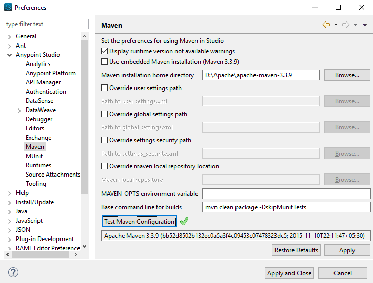

[arabic, start=4]
. Install the Connector from *https://docs.mulesoft.com/exchange/[Anypoint Exchange].*

[loweralpha]
. In Anypoint Studio, click the Exchange icon  in the taskbar.
. Click *Login* in the Exchange popup and Sign in.
+
*Note:* To complete this step, you must have a Mulesoft account. You can create an account on the https://anypoint.mulesoft.com/login/#/signin[Mulesoft Sign up] page.
. Enter _Veeva Vault_ in the search box and hit Enter.
. Click Veeva Vault Connection and then click Install
. Follow the remaining instructions to complete the installation of the connector.
. In Anypoint Studio click Help > Installation Details.
. Verify Veeva Vault connector appears in the list of installed software.
+
*Note: The steps in the version of Anypoint Studio on your system might be different to the ones described here.*

For information about installing connectors, see https://docs.mulesoft.com/connectors/[Installing Connectors]

When Studio has an update, a message displays in the lower right corner, which you can click to install the update.

==== Configuration:

You can configure the connector to connect to Veeva Vault using *Basic Authentication*

*Basic Authentication*

[arabic]
. Drag and drop the any of connector operation to the Studio Canvas.
. Click on icon  of Connector configuration to create global element for the connector configurations.
+

. *Set these fields:*

*Username Password Authentication:*

image:media/user-guide/image6.png[image,width=579,height=183]

[cols=",",options="header",]
|===
|*Field* |*Description*
|*Name* |Enter a name for this configuration to reference it later.
|*Vault URL* |Enter Veeva Vault instance URL.
|*Username* |Enter the Veeva Vault instance username.
|*Password* |Enter the corresponding password.
|*Version* |Enter the Veeva Vault instance version (e.g: v19.1)
|*Client Id* |Enter Client Id in format *\{organisation}-{company\|team}* to send with each request in header for tracking purpose. The Client Id is prefix with *"mulesoft"* and suffix with *"client-vaultconnector"* internally. E.g : *mulesoft-abcpharma-clinicalprod-client-vaultconnector*
|===

In the images above, the placeholder values refer to a configuration file placed in the folder (src/main/resources) of your project. You can either hardcode your credentials into the global configuration properties or reference a configuration file that contains these values. For simpler maintenance and better re-usability of your project, Mule recommends that you use a configuration file. Keeping these values in a separate file is useful if you need to deploy to different environments, such as production, development, and QA, where your access credentials differ. E.g. Below is an example snippet of configuration.yaml file under folder (src/main/resources/config)

--------------------
	#Veeva Vault details
	veeva:
		vaultURL: "https://xxxx-xxxx.veevavault.com"
		username: "someone@example.com"
		password: "xxxxxxx"
		version : "v19.1"
		clientId: "mulesoft-abcpharma-clinicalprod-client-vaultconnector"
--------------------

The Connection Configuration will do Basic Authentication which will accept required parameters – *Vault URL, Username, Password* to perform connection with Veeva Vault instance to retrieve Session. The retrieved session will be used for each operation configured in Mule application for sending request.

*Burst API Limit Exceed Profile:*

The Burst API limit exceed profile configuration (*Connector Configuration > Advanced Tab*) to act upon if Burst API limit of Veeva Vault API is exceeded or reach threshold configure.

By default, this option is enabled. If Burst API Limit Exceed Profile is enabled, then connector will evaluate Veeva APIs response header (*X-VaultAPI-BurstLimitRemaining*) value with API Limit threshold specified value. At Vault API burst limit remaining value exceed or reach this threshold value, the connector will wait for specified Wait time to roll over the Burst Limit Remaining in 5 minutes window.

Below is an example from the application logs showing a warning message at 2019-06-06 10:34:45,096 and subsequently waiting for 5 minutes before re-running as shown in the next message after 5 minutes at 2019-06-06 10:39:45,098.

--------------------

WARN 2019-06-06 10:34:45,096 [[MuleRuntime].io.27: [veevavault-connector-demo].get-documents-operationFlow.BLOCKING @2dd2ffaf] [event: 99716950-8818-11e9-90e2-d61515f42856] org.mule.extension.veevavault.internal.service.HttpRequestService: Burst API Limit remaining calls [1997] has exceeded/reached an API Limit Profile threshold set as [1997]. As per API Limit Profile, Veeva Vault Connector will wait for [5] MINUTES.

WARN 2019-06-06 10:39:45,098 [[MuleRuntime].io.27: [veevavault-connector-demo].get-documents-operationFlow.BLOCKING @2dd2ffaf] [event: 99716950-8818-11e9-90e2-d61515f42856] org.mule.extension.veevavault.internal.operations.VeevaVaultOperations: Properties or Fields is not available for api [/api/v18.2/metadata/objects/documents/types/site_management__c] , will use input list [[name__v, type__v, subtype__v, classification__v, lifecycle__v, status__v, study__v, product__v, id]] if configured to build VQL query

INFO 2019-06-06 10:39:45,098 [[MuleRuntime].io.27: [veevavault-connector-demo].get-documents-operationFlow.BLOCKING @2dd2ffaf] [event: 99716950-8818-11e9-90e2-d61515f42856] org.mule.extension.veevavault.internal.pagination.GetDocumentsPagingProvider: Query Build :: SELECT name__v, type__v, subtype__v, classification__v, lifecycle__v, status__v, study__v, product__v, id FROM documents WHERE name__v= 'F22611234--6764'

INFO 2019-06-06 10:39:46,024 [[MuleRuntime].io.27: [veevavault-connector-demo].get-documents-operationFlow.BLOCKING @2dd2ffaf] [event: 99716950-8818-11e9-90e2-d61515f42856] org.mule.extension.veevavault.internal.service.HttpRequestService: Response received for sync http request :: 'https://[vault-domain]/api/v18.2/query?q=SELECT+name__v%2C+type__v%2C+subtype__v%2C+classification__v%2C+lifecycle__v%2C+status__v%2C+study__v%2C+product__v%2C+id+FROM+documents+WHERE+name__v%3D+%27F22611234--6764%27++LIMIT+1000+OFFSET+0' in 925 milliseconds.

--------------------

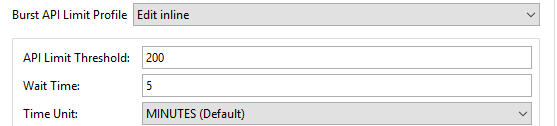

[cols=",",options="header",]
|===
|*Field* |*Description*
|*API Limit Threshold* |Enter API threshold limit that Veeva API Burst limit reached or exceed this threshold, connector will wait for specified wait time. Default is 200.
|*Wait Time* |Enter Wait time for connector to wait if API Limit threshold is reached or exceeded. Default is 5 mins.
|*Time Unit* |Select time unit for wait time. Default is MINUTES.
|===

*Daily API Limit Exceed Profile:*

The Daily API limit exceed profile configuration (*Connector Configuration > Advanced Tab*) to act upon if Daily API limit of Veeva Vault API is exceeded or reach threshold configure. The Daily limit is the total numbers of API calls within any 24-hour window on a daily rolling basis.

By default, this option is enabled. If the Daily API Limit Exceed Profile is enabled, then connector will evaluate Veeva APIs response header (*X-VaultAPI-DailyLimitRemaining*) value with API Limit threshold specified value, the connector will throw an exception indicating the Daily API Limit is exceeded, the exception will continue for each and every jobs/request created until daily limit is reset or roll over next day.

Below is an example logs recorded which shows warning at *2019-06-06 10:47:31,698*, then an error is thrown at *2019-06-06 10:47:31,699*.

--------------------

WARN 2019-06-06 10:47:31,698 [[MuleRuntime].io.44: [veevavault-connector-demo].get-documents-operationFlow.BLOCKING @108e7f43] [event: 624cfa50-881a-11e9-90e2-d61515f42856] org.mule.extension.veevavault.internal.service.HttpRequestService: Veeva Daily API Limit remaining calls [10000] has exceeded/reached an Daily API Limit Profile threshold set as [10000]. As per API Limit Profile, Veeva Vault Connector will throw an exception.

ERROR 2019-06-06 10:47:31,699 [[MuleRuntime].io.44: [veevavault-connector-demo].get-documents-operationFlow.BLOCKING @108e7f43] [event: 624cfa50-881a-11e9-90e2-d61515f42856] org.mule.extension.veevavault.internal.service.HttpRequestService: Exception caught while processing Sync request ::: https://xxxxx-xxxxx.veevavault.com/api/v19.1/metadata/vobjects/site__v, Exception ::: \{"responseStatus":"FAILURE","errors":[\{"type":"API_LIMIT_EXCEED","message":"The Veeva Vault Connector has reached/exceeded daily API limit remaining calls [10000]. The configured daily api limit threshold is (10000)"}]}

ERROR 2019-06-06 10:47:31,767 [[MuleRuntime].io.44: [veevavault-connector-demo].get-documents-operationFlow.BLOCKING @108e7f43] [event: 624cfa50-881a-11e9-90e2-d61515f42856] org.mule.runtime.core.internal.exception.OnErrorPropagateHandler:

**********************************************************************************

Message : An error occurred from the Veeva Vault API.
Error Code: API_LIMIT_EXCEED.
Original Error Message: The Veeva Vault Connector has reached/exceeded daily API limit remaining calls [10000]. The configured daily api limit threshold is (10000).
Error type : VEEVAVAULT:API_LIMIT_EXCEED

**********************************************************************************
--------------------

[cols=",",options="header",]
|===
|*Field* |*Description*
|*API Limit Threshold* |Enter API threshold limit that Veeva API Burst limit reached or exceed this threshold, connector will wait for specified wait time. Default is 10000.
|===

*Response Timeout:*

The maximum time in milliseconds that the connector will wait for the Veeva Vault response. If time elapse will throw Timeout Exception. By default, is 30,000 milliseconds.

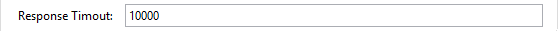

[cols=",",options="header",]
|===
|*Field* |*Description*
|*Response Timeout* |Enter timeout value for connector to wait for response from Veeva Vault instance. Default is 30 seconds.
|===

=== Use the Connector in a Mule Flow:

Following are the list of operations with the connector:

*Documents*

* link:#create-documents[*Create Documents*]
* link:#get-documents[*Get Documents*]
* link:#delete-documents[*Delete Documents*]
* link:#update-documents[*Update Documents*]
* link:#export-documents[*Export Documents*]

*Document Renditions*

* link:#create-document-renditions[*Create Document Renditions*]
* link:#get-document-renditions-types[*Get Document Renditions Types*]
* link:#delete-document-renditions[*Delete Document Renditions*]

*Vault Objects*

* link:#create-object-records[*Create Object Records*]
* link:#get-object-records[*Get Object Records*]
* link:#delete-object-records[*Delete Object Records*]
* link:#update-object-records[*Update Object Records*]

*VQL Query*

* link:#query[*Query*]

*Picklists*

* link:#get-picklists[*Get Picklists*]

*Audit*

* link:#get-audit-details[*Get Audit Details*]

==== Create Documents

The Create Documents operation allows to create single or multiple document(s) with provided document metadata in CSV or JSON format. Make sure you have uploaded document files on Vault FTP server location for document content to attach with created documents.

*Configurations:*

*Connector Configuration:*

*Follow the instructions mentioned in link:#configuration[Connector Configuration]*

*Operation Configuration:*

image:media/user-guide/image10.png[image,width=601,height=90]

[cols=",",options="header",]
|===
|Field |Description
|Metadata Format |Select CSV or JSON option to accept document metadata in specified format.
|Document Metadata |Document Metadata payload with required metadata either in CSV or JSON format. Make sure payload would be in format as specified in Metadata format field.
|Input a|
You can find following list of document metadata required to create document(s) on vault. Make sure payload should have mandatory metadata as per vault.

image:media/user-guide/image11.png[image,width=283,height=326]

|Output a|
You can find create documents operation output status or response from vault.

image:media/user-guide/image12.png[image,width=297,height=213]

Note : It’s important to check response status of Success and Failure of operation in section link:#connector-operations-success-and-failure-response[*Connector Operations SUCCESS and FAILURE Response*].

|===

==== Get Documents

The Get Documents operation allows to retrieve document details based on document type, subtype and classification selected. Using selected type, subtype and classification it fetches document properties metadata and builds VQL queries dynamically. The VQL query is then executed on Vault to retrieve document details. Place For-Each/Splitter element after this Operation to fetch each document data (page) sequentially.

Note – The output of the operation would be in pagination mechanism, please refer to link:#streaming-and-pagination[Streaming and Pagination] for more details.

The document type, subtype and classification are optional, if none are selected then document properties metadata are fetched using API *(/api/\{version}/metadata/objects/documents/properties)* and VQL Query is built based on document metadata properties added/inserted in Document Properties list, if metadata properties are not provided then all queryable document properties is used in VQL and executed.

*Configurations:*

*Connector Configuration:*

*Follow the instructions mentioned in link:#configuration[Connector Configuration]*

*Operation Configuration:*

image:media/user-guide/image13.png[image,width=601,height=355]

[cols=",",options="header",]
|===
|Fields |Description
|Type (Optional) |Click on icon  to retrieve Document Types from vault. Select a document type from the list to retrieve document properties.
|Subtype (Optional) |Click on icon  to retrieve Document Subtypes from vault. Select a document subtype from the list to retrieve document properties.
|Classification (Optional) |Click on icon  to retrieve Document Classification from vault. Select a document classification from the list to retrieve document properties.
|Document Properties (Optional) |Insert document properties as per business requirement and these properties will be used to build a VQL query to execute on vault.
|WHERE Clause |Insert a https://developer.veevavault.com/vql/#introduction-to-vault-queries[VQL] WHERE clause (without using keyword WHERE) conditions as per business requirement and it will be appended to dynamically to build VQL query to execute on vault. *E.g classification__v = ‘study_set_up_worksheet__c’*
|Fetch Size |Provide number of records per page. Default is 1000.
|Batch Size |Provide number of pages per batch. Default is 10.
|Input |N/A
|Output a|
You can find list of queryable document properties retrieved from vault. If document properties list is provided, then specified properties detail would retrieve and result in operation output. Default would be list of all queryable properties.

image:media/user-guide/image15.png[image,width=288,height=313]

|===

==== Delete Documents

The Delete Documents operation allows to delete document single or multiple document(s) with bulk API using CSV or JSON format input metadata.

*Configurations:*

*Connector Configuration:*

*Follow the instructions mentioned in link:#configuration[Connector Configuration]*

*Operation Configuration:*

image:media/user-guide/image16.png[image,width=601,height=90]

[cols=",",options="header",]
|===
|Field |Description
|Metadata Format |Select CSV or JSON option to accept document metadata in specified format.
|Document Metadata |Document Metadata payload with required metadata either in CSV or JSON format.
|Input a|
You can find following list of document metadata required to delete document(s) on vault.

image:media/user-guide/image17.png[image,width=301,height=55]

|Output a|
You can find delete documents operation output status or response from vault.

image:media/user-guide/image18.png[image,width=300,height=147]

*Note : It’s important to check response status of Success and Failure of operation in section link:#connector-operations-success-and-failure-response[Connector Operations SUCCESS and FAILURE Response].*

|===

==== Update Documents

The Update Documents operation allows to update bulk document(s) with provided editable metadata in payload either in CSV or JSON format.

*Configurations:*

*Connector Configuration:*

*Follow the instructions mentioned in link:#configuration[Connector Configuration]*

*Operation Configuration:*

image:media/user-guide/image19.png[image,width=601,height=95]

[cols=",",options="header",]
|===
|Field |Description
|Metadata Format |Select CSV or JSON option to accept document metadata in specified format.
|Document Metadata |Document Metadata payload with required editable metadata either in CSV or JSON format. Make sure payload would be in format as specified in Metadata format field.
|Input a|
You can find following list of editable document metadata to update document(s) on vault. Make sure payload should have only editable metadata as per vault.

image:media/user-guide/image20.png[image,width=286,height=343]

|Output a|
You can find create documents operation output status or response from vault.

|===

==== Export Documents

An Export Documents operation allows to query a set of documents for export to your vault’s FTP Staging server. It is recommended to use Export Documents operation is separate asynchronous flow using Async Scope and passing payload with document ids. Using asynchronously the operation executes in separate flow thread, will wait for specified polling interval to poll the Job status until it gets successful while the main flow continues its process.

The exported documents are stored on FTP Staging area in folder hierarchy structure – *\{root}/\{userId}/\{jobId}/\{documentIds}/\{versions}*. The Export Documents operation will return job results as response. For example:
--------------------
[
  {
    "file": "/41601/249051/0_1/TestDocument.docx",
    "user_id__v": 1885110,
    "id": 249051,
    "responseStatus": "SUCCESS",
    "minor_version_number__v": 1,
    "major_version_number__v": 0
  },
  {
    "file": "/41601/249050/0_1/TestDocument.docx",
    "user_id__v": 1885110,
    "id": 249050,
    "responseStatus": "SUCCESS",
    "minor_version_number__v": 1,
    "major_version_number__v": 0
  },
  {
    "file": "/41601/249052/0_1/TestDocument.docx",
    "user_id__v": 1885110,
    "id": 249052,
    "responseStatus": "SUCCESS",
    "minor_version_number__v": 1,
    "major_version_number__v": 0
  }
]
--------------------

The above example shows attributes as under :
 
*file – "/{jobId}/{documentId}/{major-minor-version}/{filename}"*. It’s file absolute path location on Vault FTP server staging area.
 
*user_id__v* –  It’s a Vault system user Id of an user whose credentials are configured in connector. The folder is created in the name of user Id prefix with *‘u’ (e.g: uXXXXXXX)* on Vault FTP server staging area root location and under which exported file is located – *(e.g: "/uXXXXXXX/{jobId}/{documentId}/{major-minor-version}/{filename})"*.

*id* – It’s a document Id of exported document file.

*major_version_number__v* – It’s a major version number of exported document file.

*minor_version_number__v* – It’s a minor version number of exported document file.

*Configurations:*

*Connector Configuration:*

Follow the instructions mentioned in link:#configuration[*Connector Configuration*]

*Operation Configuration:*

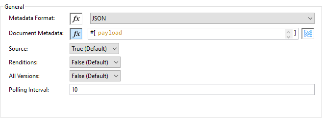

[cols=",",options="header",]
|===
|*Field* |*Description*
|*Metadata Format* |Select CSV or JSON option to accept metadata document Id in specified format.
|*Document Metadata* |Document Metadata payload contains document Ids in either in CSV or JSON format. Make sure payload would be in format as specified in Metadata format field.
|*Source* |Optional, to exclude source files set to false. Default is true.
|*Renditions* |Optional, to include renditions set to true. Default is false.
|*All Versions* |Optional, to include all versions or latest version set to true. Default is false.
|*Polling Interval* |Optional, to polls vault at specified interval in seconds until job is successful. Default is 30 seconds.
|*Input* a|
You can find following input document metadata required to export document(s) from vault to FTP staging server. Make sure payload should have mandatory metadata as per vault.

|*Output* a|
You can find export documents job status response under output tab.

*Note : Its important to check response status of Success and Failure of operation in section link:#connector-operations-success-and-failure-response[Connector Operations SUCCESS and FAILURE Response].*

|===

==== Create Document Renditions:

The Create Document Renditions operation allows to add document renditions in bulk. Your vault must be in Migration Mode before using this operation. It takes maximum CSV input data of size 1GB with value in standard UTF-8 encoded.

*Configurations:*

*Connector Configuration:*

*Follow the instructions mentioned in link:#configuration[Connector Configuration]*

*Operation Configuration:*

image:media/user-guide/image10.png[image,width=601,height=90]

[cols=",",options="header",]
|===
|*Field* |*Description*
|*Metadata Format* |Select CSV or JSON option to accept document metadata in specified format.
|*Document Metadata* |Document Metadata payload with required metadata either in CSV or JSON format. Make sure payload would be in format as specified in Metadata format field.
|*Input* a|
You can find following list of document metadata required in payload under Input tab of operation.

|*Output* a|
You can find following operation output or response under Output tab.

image:media/user-guide/image26.png[image,width=283,height=202]

*Note* : It’s important to check response status of Success and Failure of operation in section link:#connector-operations-success-and-failure-response[*Connector Operations SUCCESS and FAILURE Response*].

|===

==== Get Document Renditions Types

The Get Document Renditions Types operation allows to retrieve document renditions types detail.

*Configurations:*

*Connector Configuration:*

Follow the instructions mentioned in link:#configuration[*Connector Configuration*]

*Operation Configuration:*

image:media/user-guide/image27.png[image,width=601,height=61]

[cols=",",options="header",]
|===
|*Field* |*Description*
|*Document Metadata* |Document Id in payload either in CSV or JSON format.
|*Input* a|
You can see document Id required in payload under Input tab of operation to retrieve document renditions details

image:media/user-guide/image28.png[image,width=293,height=38]

|*Output* a|
You can find following operation output or response under Output tab.

image:media/user-guide/image29.png[image,width=300,height=145]

*Note* : It’s important to check response status of Success and Failure of operation in section link:#connector-operations-success-and-failure-response[*Connector Operations SUCCESS and FAILURE Response*].

|===

==== Delete Document Renditions

The Delete Document Renditions operation allows to delete document renditions in bulk using CSV or JSON format input metadata.

*Configurations:*

*Connector Configuration:*

Follow the instructions mentioned in link:#configuration[*Connector Configuration*]

*Operation Configuration:*

image:media/user-guide/image16.png[image,width=601,height=90]

[cols=",",options="header",]
|===
|*Field* |*Description*
|*Metadata Format* |Select CSV or JSON option to accept document metadata in specified format.
|*Document Metadata* |Document Metadata payload with required metadata either in CSV or JSON format.
|*Input* a|
You can find following list of document metadata required to create document(s) on vault. Make sure payload should have mandatory metadata as per vault.

|*Output* a|
You can find delete document renditions operation output status or response from vault.

image:media/user-guide/image31.png[image,width=285,height=208]

*Note* : It’s important to check response status of Success and Failure of operation in section link:#connector-operations-success-and-failure-response[*Connector Operations SUCCESS and FAILURE Response*].

|===

==== Create Object Records

The Create Object Records operation allows to create bulk object records for selected vault object with provided object metadata in CSV or JSON format.

*Configurations:*

*Connector Configuration:*

Follow the instructions mentioned in link:#configuration[*Connector Configuration*]

*Operation Configuration:*

image:media/user-guide/image32.png[image,width=601,height=112]

[cols=",",options="header",]
|===
|*Field* |*Description*
|*Object Name* |Click on icon  to retrieve vault object list. Select the object name from the list to create records for selected object.
|*Metadata Format* |Select CSV or JSON option to accept object metadata in specified format.
|*Object Metadata* |Object fields payload with required metadata either in CSV or JSON format. Make sure payload would be in format as specified in Metadata format field.
|*Input* a|
You can find following list of object metadata required to create object records.

|*Output* a|
You can find operation output or response retrieved from vault for an object records created.

image:media/user-guide/image34.png[image,width=296,height=163]

*Note* : It’s important to check response status of Success and Failure of operation in section link:#connector-operations-success-and-failure-response[*Connector Operations SUCCESS and FAILURE Response*].

|===

==== Get Object Records

The Get Object Records operation allows to retrieve object records detail using object metadata fields to build a VQL query dynamically and execute on vault to get Object details. Place For-Each/Splitter element after this Operation to fetch each object records (page) sequentially.

Note – The output of the operation would be in pagination mechanism, please refer to link:#streaming-and-pagination[Streaming and Pagination] for more details.

*Configurations:*

*Connector Configuration:*

Follow the instructions mentioned in link:#configuration[*Connector Configuration*]

*Operation Configuration:*

image:media/user-guide/image35.png[image,width=601,height=355]

[cols=",",options="header",]
|===
|*Fields* |*Description*
|*Vault Object* |Click on icon  to retrieve vault objects list from vault. Select an object from the list to retrieve object records detail.
|*Object Fields* (Optional) |Insert object fields as per business requirement and these fields will be used to build a VQL query to execute on vault.
|*WHERE Clause* |Insert a https://developer.veevavault.com/vql/#introduction-to-vault-queries[VQL] WHERE clause (without using keyword WHERE) conditions as per business requirement and it will be appended to dynamically to build VQL query to execute on vault. *E.g study_country__v = ‘0SC000000000101’*
|*Fetch Size* |Provide number of records per page. Default is 1000.
|*Batch Size* |Provide number of pages per batch. Default is 10.
|*Input* |N/A
|*Output* a|
You can find the list of object records fields to refer to add into Object fields list. If object fields list is provided, then specified fields detail returns as output. Default would be list of all fields.

image:media/user-guide/image36.png[image,width=282,height=306]

|===

==== Delete Object Records

The Delete Object Records operation allows to delete single or multiple object record(s) with bulk API using CSV or JSON format input metadata.

*Configurations:*

*Connector Configuration:*

Follow the instructions mentioned in link:#configuration[*Connector Configuration*]

*Operation Configuration:*

image:media/user-guide/image32.png[image,width=601,height=112]

[cols=",",options="header",]
|===
|*Field* |*Description*
|*Object Name* |Click on icon  to retrieve vault object list. Select the object name from the list to delete object records for selected object.
|*Metadata Format* |Select CSV or JSON option to accept document metadata in specified format.
|*Object Metadata* |Object fields payload with required metadata either in CSV or JSON format. Make sure payload would be in format as specified in Metadata format field.
|*Input* a|
You can find following list of object metadata required to delete object records.

image:media/user-guide/image37.png[image,width=300,height=70]

|*Output* a|
You can find operation output or response retrieved from vault for an object records deleted.

image:media/user-guide/image38.png[image,width=303,height=110]

*Note* : It’s important to check response status of Success and Failure of operation in section link:#connector-operations-success-and-failure-response[*Connector Operations SUCCESS and FAILURE Response*].

|===

==== Update Object Records

The Update Object Records operation allows to update object records of specified vault object.

*Configurations:*

*Connector Configuration:*

Follow the instructions mentioned in link:#configuration[*Connector Configuration*]

*Operation Configuration:*

image:media/user-guide/image32.png[image,width=601,height=112]

[cols=",",options="header",]
|===
|*Field* |*Description*
|*Object Name* |Click on icon  to retrieve vault object list. Select the object name from the list to update object records of vault object.
|*Metadata Format* |Select CSV or JSON option to accept object metadata in specified format.
|*Object Metadata* |Object fields payload with required metadata either in CSV or JSON format. Make sure payload would be in format as specified in Metadata format field.
|*Input* a|
You can find following list of object metadata required to create object records.

|*Output* a|
You can find object status of an object updated as an output or response retrieved from vault under output tab of operation.

*Note* : It’s important to check response status of Success and Failure of operation in section link:#connector-operations-success-and-failure-response[*Connector Operations SUCCESS and FAILURE Response*].

|===

==== Query

The Query Operation allows to execute specified VQL query on Vault and retrieve result in paginated data input stream. Place For-Each/Splitter after Query Operation to fetch each record in sequence order. Note - Do not specify LIMIT and OFFSET in VQL query. These parameters are incorporated internally.

Note – The output of the operation would be in pagination mechanism, please refer to link:#streaming-and-pagination[Streaming and Pagination] for more details.

*Configurations:*

*Connector Configuration:*

Follow the instructions mentioned in link:#configuration[*Connector Configuration*]

*Operation Configuration:*

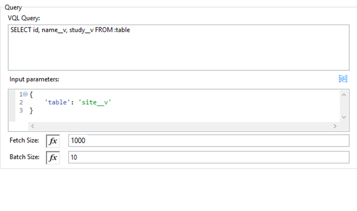

[cols=",",options="header",]
|===
|*Field* |*Description*
|*VQL Query* a|
Enter https://developer.veevavault.com/vql/#introduction-to-vault-queries[VQL] query to send it to Vault.

*Note -- Do not specify LIMIT and OFFSET in VQL query.*

|*Input Parameters* a|
The input parameters are to pass parameter(s) to VQL query dynamically. The parameters should be name-value pair, payload or variables value can be pass. Eg.

____
#[
	{

		'table': 'site__v',

	}
]
____

Default parameter is *#[\{}].*

|*Fetch Size* |Provide number of records per page. Default is 1000.
|*Batch Size* |Provide number of pages per batch. Default is 10.
|*Input* |N/A
|*Output* a|
You can find the specified VQL query fields in output tab of operation. It returns specified VQL query result contains pagination data.

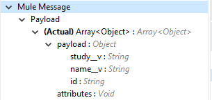

|===

*Use Input Parameters to Protect VQL Queries*

The Query operation is used to retrieve documents, object, workflow information from the Vault. The primary concept of this operation is to supply a VQL query and use DataWeave to supply the parameters:

In the above example, input parameters are supplied as key-value pairs, which you can create by embedding a DataWeave script. Those keys are used in conjunction with the semicolon character (:) to reference a parameter value by name. This is the recommended approach for using parameters in your VQL query.

The alternative is to directly write ` *<veevavault:vql>SELECT id, name__v, study__v FROM documents WHERE name__v = #[payload] </veevavault:vql>`*, but this is a very dangerous practice that is not recommended.

*Advantages of using input parameters to configure the WHERE clause in a SELECT statement this way:*

* The query becomes immune to VQL injection attacks.
* The connector can perform optimizations that are not possible otherwise, which improves the app’s overall performance.

==== Get Picklists

The Get Picklists operation allows to retrieve all available picklist values configured on a picklist.

*Configurations:*

*Connector Configuration:*

Follow the instructions mentioned in link:#configuration[*Connector Configuration*]

*Operation Configuration:*

image:media/user-guide/image43.png[image,width=601,height=60]

[cols=",",options="header",]
|===
|*Field* |*Description*
|*Picklist Name* (Optional) |Click on icon  to retrieve picklists from vault. Select a picklist name from the list to retrieve picklist values.
|*Input* |N/A
|*Output* a|
You can find picklist values with name and label as an output of Get Picklists operation.

image:media/user-guide/image44.png[image,width=284,height=91]

|===

==== Get Audit Details

The Get Audit Detail operation allows to retrieve audit details for specified audit type.

Note – The output of the operation would be in pagination mechanism, please refer to link:#streaming-and-pagination[Streaming and Pagination] for more details.

*Configurations:*

*Connector Configuration:*

Follow the instructions mentioned in link:#configuration[*Connector Configuration*]

*Operation Configuration:*

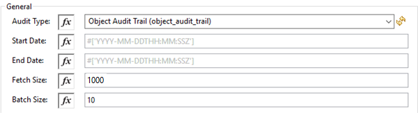

[cols=",",options="header",]
|===
|*Field* |*Description*
|*Audit Type* |Click on icon  to retrieve audit types from vault. Select an audit type from the list whose audit details need to retrieve.
|*Start date* |Optional, specify start date to retrieve audit information. This date cannot be more than 30 days ago. Dates must be YYYY-MM-DDTHH:MM:SSZ format. Dates and times are in UTC. If time is not specified, it will default to midnight (T00:00:00Z) on the specified date.
|*End date* |Optional, specify end date to retrieve audit information. This date cannot be more than 30 days ago. Dates must be YYYY-MM- DDTHH:MM:SSZ format. Dates and times are in UTC. If time is not specified, it will default to midnight (T00:00:00Z) on the specified date.
|*Fetch Size* |Provide number of records per page. Default is 1000.
|*Batch Size* |Provide number of pages per batch. Default is 10.
|*Input* |N/A
|*Output* a|
The following selected audit type details retrieved from vault in pagination format. Make sure to use For each / Splitter to fetch each record.

|===

=== Connector Operations SUCCESS and FAILURE response

The Veeva Vault Connector operation responses are based on the Veeva API success or failure response with an error. The connector returns SUCCESS response at HIGH LEVEL and SUCCESS or FAILURE at LOW LEVEL (it means connector operation is SUCCESS but some to documents/object records failed to create/update due to some irrelevant metadata pass in request. For e.g.:

* *SUCCESS with SUCCESS response*
--------------------
{

"responseStatus": "SUCCESS"
	"data":[
		{
			"id": 239026,
			"name__v": "E22611234--38483",
			"responseStatus": "SUCCESS"
		},
		{
			"id": 239025,
			"name__v": "Kick-off Meeting Material Updated12341234--81032",
			"responseStatus": "SUCCESS"
		}
	]
}
--------------------

* *SUCCESS with a FAILURE response*

--------------------
{
	"data": [
		{
			"external_id__v": "TEST-238924",
			"rendition_type__v": "imported_rendition__c",
			"id": 238924,
			"responseStatus": "FAILURE",
			"minor_version_number__v": 1,
			"errors": [
				{
					"type": "INVALID_DATA",
					"message": "Document not found [238924/0/1]."
				}
			],
			"major_version_number__v": 0
		},
		{
			"external_id__v": "TEST-238925",
			"rendition_type__v": "imported_rendition__c",
			"id": 238925,
			"responseStatus": "FAILURE",
			"minor_version_number__v": 1,
			"errors": [
				{
					"type": "INVALID_DATA",
					"message": "Document not found [238925/0/1]."
				}
			],
			"major_version_number__v": 0
		}
	],
	"responseStatus": "SUCCESS"
}
--------------------

The Veeva Vault operations throw an exception when Veeva APIs returns a FAILURE response. E.g:

* *FAILURE with an ERROR response*
--------------------
{
	"responseStatus": "FAILURE",+
	"errors": [
		{
			"type": "INVALID_DATA",
			"message": "Unknown relationship [reviewer__v]"
		}
	]
}
--------------------
On receiving above FAILURE response from Veeva APIs, the connector operations will throw an exception, which needs to be caught in Error Handling component within Mule flow. E.g.:

--------------------
**********************************************************************************
Message : An error occurred from the Veeva Vault API.
Error Code: INVALID_DATA.
Original Error Message: Unknow relationship [reviewer__v].
Error type : VEEVAVAULT:INVALID_DATA
**********************************************************************************
--------------------

Following are the Error codes that can be caught in Error Handling component

* VEEVAVAULT:API_LIMIT_EXCEEDED
* VEEVAVAULT:ATTRIBUTE_NOT_SUPPORTED
* VEEVAVAULT:INACTIVE_USER
* VEEVAVAULT:INVALID_DATA
* VEEVAVAULT:INVALID_DOCUMENT
* VEEVAVAULT:INSUFFICIENT_ACCESS
* VEEVAVAULT:MALFORMED_URL
* VEEVAVAULT:METHOD_NOT_SUPPORTED
* VEEVAVAULT:NO_PERMISSION
* VEEVAVAULT:OPERATION_NOT_ALLOWED
* VEEVAVAULT:PARAMETER_REQUIRED

=== Streaming and Pagination

All the operations (except Download Document) in connector returns an InputStream as payload with respective results based on operation output. Because of an InputStream is returned as payload Mule by default applies Streaming Strategies, please refer to https://docs.mulesoft.com/mule-runtime/4.2/streaming-about[Mule Streaming Strategies] in more details. You can find streaming strategies configuration in *Advanced* tab of connector operations.

The following operations in connector provides pagination mechanism based on Mule standard pagination.

* link:#get-documents[*Get Documents*]
* link:#get-object-records[*Get Object Records*]
* link:#query[*Query*]
* link:#get-audit-details[*Get Audit Details*]

While using these above paginated operations make sure to place For-Each/Splitter to retrieve each object (metadata’s in JSON format) at a time. The pagination operations have fields – *Fetch Size and Batch Size.*

* *Fetch Size:* The Fetch Size is a limit number of records that can be retrieve in a page. The operation would return the pages with fetch size number of JSON object records. Note, in some cases, Veeva API’s auto-calculate fetch size (number of records on each page) based on record size accumulated exceed the standard record size. The operation will return calculated records on each page.
* *Batch Size:* The Batch Size is number of pages it would return in each batch and each page will have fetch size number of records. The operation would return number of records (metadata’s in JSON format) per batch is calculated as below, *e.g*.:
--------------------
Fetch Size set as *1000*
Batch Size set as *10*

Total records in vault say has *100,000* records then

Number of pages = Total records/Fetch Size
				= 100000/1000
				= 100 pages.
				
Number of pages per batch 	= Number of pages/Batch Size
							= 100/10
							= 10 pages per batch.
							
Number of Records per batch = Number of pages per batch * Fetch Size
							= 10 * 1000
							= 10,000 records.
							
Therefore, Number of records return per batch would be 10,000 records.
--------------------

The repeatable streams measure the buffer size in byte measurements, when handling objects the runtime measures the buffer size using instance counts.

In non-repeatable stream connector operation would returns stream as number of records per batch and in repeatable stream would returns all records in once, so when calculating the in-memory buffer size for repeatable auto-paging, you need to estimate how much memory space each instance takes to avoid running out of memory.

=== Demo Projects

The demo project we provide can be a starting point for your MuleSoft project. The demo project contains sample flows for these operations:

[cols=",,,",options="header",]
|===
|*Operations* |*Description* |*Use Case Template* |*Sample Code*
|*Create Documents* |Create Document operation creates document(s) on vault. Use this option when you want to create documents in bulk with document metadata received from external source. The documents created status is inserted into – Database. However, you can trigger to external source etc. |https://anypoint.mulesoft.com/exchange/c5788341-a495-4d6f-a931-875757082c63/filesystem-to-veeva-vault-template/[FileSystem to VeevaVault] |link:#create-documents-example[Create Documents]
|*Get Documents* |Get Documents operations retrieves document details. Use this option when you want to retrieve document details based on type, subtype, classification document properties and VQL query. The document details retrieved in pagination and in order to fetch each record a For-Each element is added which will transform insert records into database. However, you can trigger to external source etc. |https://anypoint.mulesoft.com/exchange/c5788341-a495-4d6f-a931-875757082c63/veevavault-connector-project-templates/[VeevaVault to FileSystem] |link:#get-documents-example[Get Documents]
|*Delete Documents* |Delete Documents operation deletes documents from vault. Use this option when you want to delete documents in bulk using document Id received from external source. The documents deleted status is stored into file system. However, you can trigger/insert to external source. | |link:#delete-documents-example[Delete Documents]
|*Update Documents* |Update Document operation update document(s) on vault. Use this option when you want to update documents in bulk with editable document metadata received from external source. The documents updates status is stored into file system. However, you can trigger to external source etc. | |link:#update-documents-example[Update Documents]
|*Create Document Renditions* |Create Document Renditions operation creates document renditions on vault. Use this option when you want to create document renditions with document metadata received from external source. The document renditions created status is written into file system. However, you can store into any other entities like – Database, Trigger to external source etc. | |link:#create-document-renditions-example[Create Document Renditions]
|*Get Document Renditions Types* |Get Document Renditions Types operation retrieves renditions types details of particular document. | |link:#_Get_Document_Renditions_2[Get Document Renditions Types]
|*Create Object Records* |Create Object Records operation creates object records of specified object in vault. Use this option when you want to create object records in bulk using object metadata received from external source. The object records created status is inserted into – Database. However, you can trigger to external source etc. |https://anypoint.mulesoft.com/exchange/c5788341-a495-4d6f-a931-875757082c63/filesystem-to-veeva-vault-template/[FileSystem to VeevaVault] |link:#create-object-records-example[Create Object Records]
|*Get Object Records* |Get Object Records operation retrieves object details. Use this option when you want to retrieve object details based on object name. The object details retrieved in pagination and in order to fetch each records a For-Each element is added which will transform and insert records into database. However, you can trigger to external source etc. |https://anypoint.mulesoft.com/exchange/c5788341-a495-4d6f-a931-875757082c63/veevavault-connector-project-templates/[VeevaVault to FileSystem] |link:#_Get_Object_Records_3[Get Object Records]
|*Update Object Records* |Update Object Records operation updates object records of specified object in vault. Use this option when you want to update object records in bulk using object metadata received from external source. The object records updated status is stored into file system. However, you can trigger to external source etc. | |link:#update-object-records-example[Update Object Records]
|*Query* |Query operation to execute VQL query on vault. Use this option when you want to retrieve document, object and workflow details using VQL query. The VQL query response retrieved in pagination and in order to fetch each records a For-Each element is added which will transform and store data into file system. However, you can trigger to external sources etc. For more details on VQL please refer Veeva https://developer.veevavault.com/vql/#introduction-to-vault-queries[Vault Query Language (VQL)]. | |link:#_Query_Example[Query]
|*Get Audit Details* |Get Audit Details operation retrieve audit details of specified audit type. Use this option when you want to retrieve audit details of an audit type. The Audit details response retrieved in pagination and in order to fetch each records a For-Each element is added which will transform and store data into file system. However, you can trigger to external sources etc. | |link:#get-audit-details-example[Get Audit Details]
|===

*To use the demo project:*

* You must know about basic concept of Veeva Vault.
* You must know about Veeva https://developer.veevavault.com/vql/#introduction-to-vault-queries[Vault Query Language (VQL)]
* You must know Mule concepts, flow, Anypoint Studio and connectors – HTTP, Database, File. Refer to https://docs.mulesoft.com/connectors/[MuleSoft Documentation]
* You must have access to Veeva Vault instance for connector configurations:

	 Username
	 Password
	 Vault URL
	 Vault version
	 Vault Client Id (This is custom Id in format - {organization}-{component|team})

* You must know about https://docs.mulesoft.com/studio/7.3/[Anypoint Studio] on how to create Mule projects.

==== Create Documents Example

To create Mule flow, follow these instructions:

* Drag and drop HTTP Listener from Mule palette to project canvas.
* Configure HTTP Listener as per your environment.
* Drag Database Select operation to fetch document metadata from table.
* Configure Database connector configuration with credentials details.
* Drag Flow Reference element to reference Sub Flow – upload-files-on-vault-ftp-server.
* Drag Transform Message component to transform document metadata in CSV format.
* Drag Create Documents operation from Veeva Vault Connector palette.
* Configure Veeva Vault connection configuration with username, password, vault url, vault version, vault client Id.
* Drag Database Bulk Insert operation to insert document created status data into table
* Drag Logger element to log information in console or log file.
* Create Sub-Flow with Logger to log information.
* For-Each element containing Read file operation and FTPS Write operation to write file on vault FTP server.
* Configure FTPS connector configuration with vault FTP server credentials details

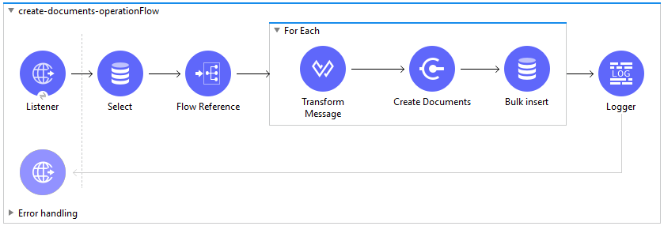

*Example XML code:*

*create-documents-operationsFlow*

--------------------
	<flow name="create-documents-operationFlow" doc:id="98fe428d-3961-41e9-afaf-1cbe2b38dee5" >
		<http:listener doc:name="Listener" doc:id="a894ea19-6344-4553-aa50-b7827c8e8096" config-ref="HTTP_Listener_config" path="/create-documents"/>
		<db:select doc:name="Select" doc:id="e5af2ee1-faf6-4397-aea8-7df1ca873abb" config-ref="Database_Config">
			<db:sql >SELECT * FROM createdocuments</db:sql>
		</db:select>
		<!-- <flow-ref doc:name="upload-files-on-vault-ftp-server" doc:id="8be764bb-bf76-4c9f-870b-fe708077e28e" name="upload-files-on-vault-ftp-server"/> -->
		<ee:transform doc:name="Transform Message" doc:id="ac21fdf2-9117-4201-a595-907e4dd1ea12">
			<ee:message>
				<ee:set-payload><![CDATA[%dw 2.0
				output application/csv headerLineNumber = 0 , header = true
				---
				payload map ( payload01 , indexOfPayload01 ) -> {
					lifecycle__v: payload01.lifecycle__v,
					study__v: payload01.study__v,
					subtype__v: payload01.subtype__v,
					name__v: payload01.name__v ++ '--' ++ randomInt(10000) as String,
					type__v: payload01.type__v,
					classification__v: payload01.classification__v,
					product__v: payload01.product__v,
					file: payload01.file as String
				}]]></ee:set-payload>
			</ee:message>
		</ee:transform>
		<veevavault:create-documents metadataFormat="CSV" doc:name="Create Documents" doc:id="5b98678c-1559-4827-80a9-289aad4a8873" config-ref="Veeva_Vault_Config"/>
		<db:bulk-insert doc:name=__"Bulk insert" doc:id="e8dd307e-40db-42bb-b82a-b72f6b235d00" config-ref="Database_Config">
			<db:bulk-input-parameters ><![CDATA[#[output application/java
			---
			payload.data map () -> {
			'id': $.id as String,
			'external_id__v': $.external_id__v as String,
			'responseStatus': $.responseStatus
			}]]]></db:bulk-input-parameters>

		<db:sql >INSERT into documents (id, external_id__v, responseStatus) VALUES (:id, :external_id__v, :responseStatus)</db:sql>
		</db:bulk-insert>
		<logger level="INFO" doc:name="Logger" doc:id="a447ff60-8deb-471c-a1be-cc6c01dfcc29" message="Document Created :: #[output application/json --- payload]"/>
		<error-handler >
			<on-error-propagate enableNotifications="true" logException="true" doc:name="On Error Propagate" doc:id="19d98427-1566-4f82-b694-f59cc6eb169a" type="ANY" >
				<logger level="INFO" doc:name="Logger" doc:id="9c23d079-fbf2-42e7-afe2-b5186a7b9a3f" message="Flow Exception Handled --  #[payload]" />
			</on-error-propagate>
		</error-handler>	
	</flow>
--------------------

*upload-files-on-vault-ftp-server (Subflow)*

--------------------
	<sub-flow name="upload-files-on-vault-ftp-server" doc:id="b92629e4-69ee-4d9d-a24c-753ff54eff41">
		<logger level="INFO" doc:name="Logger" doc:id="74d38eea-f86a-4482-a209-06b8fc9dcd8f" message="Starting File Upload on Vault FTP server...." />
		<foreach doc:name="For Each" doc:id="1d1578a5-ea4b-40d6-8b87-b34ec778f232">
			<logger level="INFO" doc:name="Logger" doc:id="44acecd2-a655-4eee-94cc-934ab7d32b92" message="Uploading file [#[payload.file]] on Vault FTP server......." />
			<file:read doc:name="Read" doc:id="4fad0c52-6d1c-452b-a51d-c5cfd3b2680b" config-ref="File_Config" path="#[payload.file]" />
			<ftps:write doc:name="Write" doc:id="fa077475-e89e-4618-a394-c01c7ac2efbc" config-ref="FTPS_Config" path="#[attributes.fileName]" />
			<set-variable value="#[vars.counter]" doc:name="Set Variable" doc:id="c8378c51-eb34-4739-a7a1-4b8e260faa65" variableName="numberOfFiles" />
		</foreach>
		<logger level="INFO" doc:name="Logger" doc:id="4d8382e4-61b3-4104-ba89-5a3209a2bb9e" message="Total Files [#[vars.numberOfFiles]]are uploaded successfully on Vault FTP server." />
	</sub-flow>
--------------------

==== Get Documents Example

To create Mule flow, follow these instructions:

* Drag and drop HTTP Listener from Mule palette to project canvas.
* Configure HTTP Listener as per your environment.
* Drag and drop Get Documents operation from Veeva Vault Connector palette.
* Configure Veeva Vault connection configuration with username, password, vault Url, vault version, vault client Id.
* Click respective refresh button to fetch document type, subtype, classification list.
* Select Type, Subtype, Classification from drop down list each.
* Add document properties in document properties list as per business requirement to incorporate properties name in VQL query build dynamically.
* Drag For-Each element after Get Documents operation.
* Drop Transform Message and Database – Insert operation from respective palette.
* Configure transformation using Dataweave as per your business need.
* Configure Insert query to insert data into table.
* Drag Set Payload element after For-Each to set payload that can be returned to triggered source.
* Drag Logger element to log information in console or log file.

*Example XML code:*

--------------------
	<flow name=__"get-documents-operationFlow"__ doc:id=__"facc29d2-8025-4b58-a3ec-322ded221705"__ >
	<http:listener doc:name=__"Listener"__ doc:id=__"93298153-7da4-4fcc-b028-00e692b0d19e"__ config-ref=__"HTTP_Listener_config"__ path=__"/get-documents"__/>
	<veevavault:get-documents doc:name=__"Get Documents"__ doc:id=__"c9e9f482-91ce-40d2-a7f7-92b39fc7e8a3"__ config-ref=__"Veeva_Vault_Config"__>
		<veevavault:documents type=__"site_management__c"__>
		<veevavault:document-properties >
		<veevavault:document-property value=__"name__v"__ />
		<veevavault:document-property value=__"type__v"__ />
		<veevavault:document-property value=__"subtype__v"__ />
		<veevavault:document-property value=__"classification__v"__ />
		<veevavault:document-property value=__"lifecycle__v"__ />
		<veevavault:document-property value=__"status__v"__ />
		<veevavault:document-property value=__"study__v"__ />
		<veevavault:document-property value=__"product__v"__ />
		</veevavault:document-properties>
		</veevavault:documents>
	</veevavault:get-documents>
	<foreach doc:name=__"For Each"__ doc:id=__"a05bd532-48eb-42a8-af56-7c9830a4433d"__ >
	<ee:transform doc:name=__"Transform Message"__ doc:id=__"d5bf0da9-e544-4728-a3e9-57dc05a02fa9"__ >
		<ee:message >
		<ee:set-payload ><![CDATA[%dw 2.0
		output application/json
		---
		payload]]></ee:set-payload>
		</ee:message>
	</ee:transform>
	<db:insert doc:name=__"Insert"__ doc:id=__"bf5a1288-8f37-456d-b26c-d18b8ea411db"__ config-ref=__"Database_Config"__>
		<db:sql >INSERT INTO [.underline]#createdocuments# (name__v, type__v, subtype__v, classification__v, lifecycle__v,
		product__v, status__v, study__v, file) VALUES (:name__v, :type__v, :subtype__v, :classification__v, :lifecycle__v, :product__v, :status__v, :study__v, :file)</db:sql>
		<db:input-parameters ><![CDATA[#[%dw 2.0
		output application/json
		---
		{
			'name__v': payload.name__v as String,
			'type__v': payload.type__v as String,
			'subtype__v': payload.subtype__v as String,
			'classification__v': payload.classification__v as String,
			'lifecycle__v': payload.lifecycle__v as String,
			'product__v': payload.product__v[0],
			'status__v': payload.status__v as String,
			'study__v': payload.study__v[0],
			'file': "CDA.docx"
		}]]]></db:input-parameters>
	</db:insert>
	</foreach>
	<set-payload value=__"#[output application/json --- payload.payload]"__ doc:name=__"Set Payload"__ doc:id=__"abcb3160-55a5-49f8-9b31-d7e61dca3d2e"__ />
	<logger level=__"INFO"__ doc:name=__"Logger"__ doc:id=__"ab49834e-389e-483e-84a4-2b61752bba72"__ message=__"Document Details :: #[payload]"__/>
	<error-handler >
	<on-error-propagate enableNotifications=__"true"__ logException=__"true"__ doc:name=__"Error Propagate"__ doc:id=__"a7ac2cf2-ec74-408b-8a02-ee1a0d24e8f4"__ type=__"ANY"__ >
	<logger level=__"INFO"__ doc:name=__"Logger"__ doc:id=__"2b932042-57f3-45d8-9e6b-3cd9fcda6509"__ message=__"Flow Exception Handled -- #[payload]"__ />
	</on-error-propagate>
	</error-handler>
	</flow>
--------------------

==== Delete Documents Example

To create Mule flow, follow these instructions:

* Drag and drop HTTP Listener from Mule palette to project canvas.
* Configure HTTP Listener as per your environment.
* Drag Database Select operation to fetch document Ids from table.
* Configure Database connector configuration with credentials details.
* Drag For-Each element and set counter as 500.
* Drag Transform Message component to transform document Ids in CSV format in For-Each.
* Drag Delete Documents operation in For-Each from Veeva Vault Connector palette.
* Configure Veeva Vault connection configuration with username, password, vault Url, vault version, vault client Id.
* Drag Logger element to log information in console or log file.

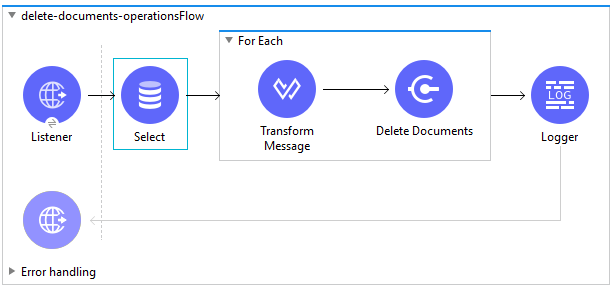

*Example XML Code:*

--------------------
	<flow name="delete-documents-operationsFlow" doc:id="21f3d675-909f-43f9-a778-0a4ffa0691de" >
		<http:listener doc:name="Listener" doc:id="4a0c72cc-d442-4c0f-b254-b1eaae48729e" config-ref="HTTP_Listener_config" path="/delete-documents"/>
		<db:select doc:name="Select" doc:id="060ea275-765b-49c2-b243-c96238cc1a85" config-ref="Database_Config">
			<db:sql >select id from deletedocuments</db:sql>
		</db:select>
		<foreach doc:name="For Each" doc:id="01af713e-bac9-4e2c-834d-8a35da4fd032" batchSize="500">
		<ee:transform doc:name="Transform Message" doc:id="8d1e28bb-2f6a-4835-9a68-bb5abf7e3ffc" >
			<ee:message >
				<ee:set-payload ><![CDATA[%dw 2.0
				output application/csv headerLineNumber = 0 , header = true , separator = ","
				---
				payload map ( payload01 , indexOfPayload01 ) -> {
					id: payload01.id as String
				}]]></ee:set-payload>
				</ee:message>
		</ee:transform>
		<veevavault:delete-documents metadataFormat="CSV" doc:name="Delete Documents" doc:id="4dde94f1-c0d5-4ea2-8f64-fc95642b823d" config-ref="Veeva_Vault_Config"/>
		</foreach>
		<logger level="INFO" doc:name="Logger" doc:id="66db562e-80c1-4db6-993e-addb3f013613" message="Document Deleted :: #[payload]"/>
		<error-handler >
			<on-error-propagate enableNotifications="true" logException="true" doc:name="On Error Propagate" doc:id="4dc356f1-5618-429e-9fc2-8a6eaee96798" type="ANY" >
				<logger level="INFO" doc:name="Logger" doc:id="c7ed420f-2acc-438a-85f7-01a6505cbb0d" message="Flow Exception Handled --  #[payload]" />
			</on-error-propagate>
		</error-handler>
	
	</flow>	
--------------------

==== Update Documents Example

To create Mule flow, follow these instructions:

* Drag and drop HTTP Listener from Mule palette to project canvas.
* Configure HTTP Listener as per your environment.
* Drag Read operation from File Palette and configure to read CSV file containing metadata.
* Drag Transform Message component to transform document metadata in CSV format and configure with mapping.
* Drag For-Each element and set counter as 500.
* Drag Update Documents operation from Veeva Vault Connector palette in For-Each.
* Configure Veeva Vault connection configuration with username, password, vault url, vault version, vault client Id.
* Select CSV from Metadata format drop down list.
* Drag Write operation from File Palette and configure file path to create file at location.
* Set Variable to store output of Update Documents operation.
* Set Payload with Variable created in previous step.
* Drag Logger element to log information in console or log file.

*Example XML Code:*

--------------------
	<flow name="update-documents-operationFlow" doc:id="9745bc16-f9f4-45c4-8ead-0e05a5d1d798" >
		<http:listener doc:name="Listener" doc:id="f0bc92a7-8c86-41ce-bcb2-d727290a0216" config-ref="HTTP_Listener_config" path="/update-documents"/>
		<file:read doc:name="Read" doc:id="106cab5f-1a44-440a-865e-9de1bac66f61" config-ref="File_Config" path="#['data/input/update-documents-data.csv']" outputMimeType="text/csv" />
		<ee:transform doc:name="Transform Message" doc:id="44e219c8-67d0-4a4a-9a05-3f5088259b60" >
		<ee:message >
			<ee:set-payload ><![CDATA[%dw 2.0
				output application/java
				---
				payload]]></ee:set-payload>
		</ee:message>
		</ee:transform>				
		<foreach doc:name="For Each" doc:id="0c36bdcc-1c1d-45bf-ac74-1401a370f270" batchSize="500">
		<ee:transform doc:name="Transform Message" doc:id="125f4490-bce5-4379-ac49-6bc680309e20" >
			<ee:message >
				<ee:set-payload ><![CDATA[%dw 2.0
				output application/csv headerLineNumber = 0 , header = true , separator = ","
				---
				payload map ( payload01 , indexOfPayload01 ) -> {
					id: payload01.id,
					notes__v: (payload01.notes__v default "") ++ payload01.product__v,
					name__v: payload01.name__v,
					product__v: payload01.product__v
				}]]></ee:set-payload>
			</ee:message>
		</ee:transform>
		<veevavault:update-documents metadataFormat="CSV" doc:name="Update Documents" doc:id="8a13cdda-6ec8-47a9-9117-44a0584ed4d1" config-ref="Veeva_Vault_Config"/>
		<file:write doc:name="Write" doc:id="9445b2fe-8780-4348-bc23-2ef44e2c4867" config-ref="File_Config" path="#['data/output/update-documents-status.json']" mode="APPEND">
			<file:content><![CDATA[#[%dw 2.0
				output application/json
				---
				payload]]]></file:content>
		</file:write>
		<set-variable value="#[output applicaiton/java --- vars.updateStatus default [] ++ [payload]]" doc:name="Set Variable" doc:id="1c523b98-aec6-4ef5-a55c-e50e57db4f0d" variableName="updateStatus"/>
		</foreach>
		<set-payload value="#[output application/json --- vars.updateStatus]" doc:name="Set Payload" doc:id="e104eb71-5fcc-4e05-9dc3-f524040893d1" />		
		<logger level="INFO" doc:name="Logger" doc:id="4bc22f37-365f-4f8a-a4a0-6ecf6f939a45" message="Document Updated :: #[payload]"/>
		<error-handler >
			<on-error-propagate enableNotifications="true" logException="true" doc:name="On Error Propagate" doc:id="4b13626b-2dc7-4bcc-a79f-b1ed523a540c" type="ANY" >
				<logger level="INFO" doc:name="Logger" doc:id="bee5def9-acb2-4d83-96ab-e20c60018182" message="Flow Exception Handled --  #[payload]" />
			</on-error-propagate>
		</error-handler>	
	</flow>
--------------------

==== Create Document Renditions Example

To create Mule flow, follow these instructions:

* Drag and drop HTTP Listener from Mule palette to project canvas.
* Configure HTTP Listener as per your environment.
* Drag Transform Message component to transform incoming payload to JSON format.
* Drag For-Each element and configure batch size to 500.
* Drag Transform Message component to transform document renditions metadata in CSV format and configure with mapping.
* Drag Create Document Renditions operation from Veeva Vault Connector palette.
* Configure Veeva Vault connection configuration with username, password, vault url, vault version, vault client Id.
* Select CSV from Metadata format drop down list.
* Drag Write operation from File palette and configure file path to record Create Document Renditions output.
* Drag Logger element to log information in console or log file.

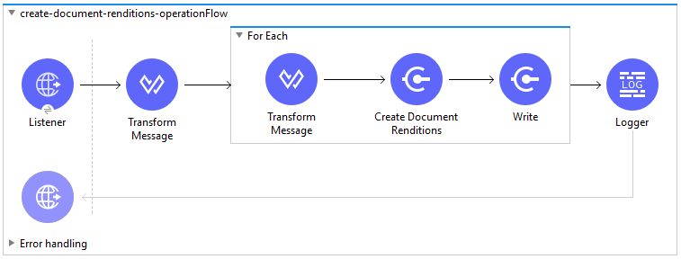

*Example XML Code:*

--------------------
	<flow name="create-document-renditions-operationFlow" doc:id="7822e654-0dc5-4a4e-9140-ad72b0a76107" >
		<http:listener doc:name="Listener" doc:id="3ecffd1a-296a-4114-ab06-ee8ebcb126ae" config-ref="HTTP_Listener_config" path="/create-document-renditions"/>
		<ee:transform doc:name="Transform Message" doc:id="a724cbe5-adbb-4987-961c-c99b81995585" >
		<ee:message >
		<ee:set-payload ><![CDATA[%dw 2.0
		output application/json
		---
		payload]]></ee:set-payload>
		</ee:message>
		</ee:transform>
		<foreach doc:name="For Each" doc:id="cddcc652-111f-4f1c-86e4-5ab42701290a" batchSize="500">
		<ee:transform doc:name="Transform Message" doc:id="4be516bc-20da-4445-8463-a530a7605d0d" >
			<ee:message >
				<ee:set-payload ><![CDATA[%dw 2.0
				output application/csv headerLineNumber = 0 , header = true , separator = ","
				---
				payload]]></ee:set-payload>
			</ee:message>
		</ee:transform>
		<veevavault:create-document-renditions doc:name="Create Document Renditions" doc:id="3f35bbe9-0d5b-4dd2-99e9-3094a0da352b" metadataFormat="CSV" config-ref="Veeva_Vault_Config"/>
		<file:write doc:name="Write" doc:id="78c44d81-4363-47f8-8cb3-6c2228b81e4a" config-ref="File_Config" path="#['data/output/create-document-renditions-status.json']" mode="APPEND">
		<file:content><![CDATA[#[%dw 2.0
		---
		output application/json
		payload]]]></file:content>
		</file:write>
		</foreach>
		<logger level="INFO" doc:name="Logger" doc:id="c370c08d-afc4-461e-9b39-d998d48549f2" message="Document Renditions Created :: #[payload]"/>
		<error-handler >
			<on-error-propagate enableNotifications="true" logException="true" doc:name="On Error Propagate" doc:id="d261e967-dcfc-425b-99fb-79210c6ceb24" type="ANY" >
				<logger level="INFO" doc:name="Logger" doc:id="f7669bc0-17f0-484d-9278-f3d7e16a578d" message="Flow Exception Handled --  #[payload]" />
			</on-error-propagate>
		</error-handler>
	
	</flow>
--------------------

==== Get Document Renditions Types Example

To create Mule flow, follow these instructions:

* Drag and drop HTTP Listener from Mule palette to project canvas.
* Configure HTTP Listener as per your environment.
* Drag Transform Message component to transform document metadata in CSV format and configure with mapping.
* Drag Get Document Renditions Types operation from Veeva Vault Connector palette.
* Configure Veeva Vault connection configuration with username, password, vault url, vault version, vault client Id.
* Drag Logger element to log information in console or log file.

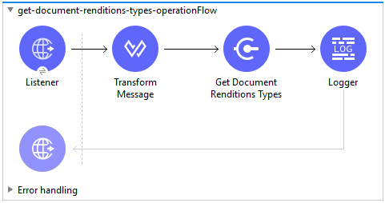

*Example XML Code*

--------------------
	<flow name="get-document-renditions-operationsFlow" doc:id="aafb952d-a198-4ea1-9b56-0730e98f32ca" >
		<http:listener doc:name="Listener" doc:id="e2835683-4c51-4202-9398-14226871dfb0" config-ref="HTTP_Listener_config" path="/get-document-renditions"/>
		<ee:transform doc:name="Transform Message" doc:id="e8ebd61f-346e-43f1-a66a-ac4c4eb781f5" >
			<ee:message >
				<ee:set-payload ><![CDATA[%dw 2.0
				output application/json
				---
				{
					documentId: '1'
				}]]></ee:set-payload>
			</ee:message>
		</ee:transform>
		<veevavault:get-document-renditions-types doc:name="Get Document Renditions" doc:id="6bff5c92-b33f-4b45-aef7-c3f900cb3fd5" config-ref="Veeva_Vault_Config"/>
		<logger level="INFO" doc:name="Logger" doc:id="575d0148-3b82-46a1-a95d-5dc2f8c52cbd" message="Get Document Renditions Response :: #[payload]"/>
		<error-handler >
			<on-error-propagate enableNotifications="true" logException="true" doc:name="On Error Propagate" doc:id="14c32e1c-6e66-463e-b36f-d16d88e8821c" type="ANY" >
				<logger level="INFO" doc:name="Logger" doc:id="57958c28-61c8-45c0-898c-f7971b44303b" message="Flow Exception Handled --  #[payload]" />
			</on-error-propagate>
		</error-handler>
	</flow>
--------------------

==== Create Object Records Example

To create Mule flow, follow these instructions:

* Drag and drop HTTP Listener from Mule palette to project canvas.
* Configure HTTP Listener as per your environment.
* Drag Transform Message component to transform object metadata in CSV format with mapping.
* Drag Create Object Records operation from Veeva Vault Connector palette.
* Configure Veeva Vault connection configuration with username, password, vault Url, vault version, vault client Id.
* Select Object Name from Object Name drop down list (Click refresh button to retrieve object name list).
* Select CSV from Metadata format drop down list.
* Drag Database Bulk Insert operation to insert document created status data into table. Make sure insert query is defined as per your requirement.
* Configure Database connector configuration with credentials details.
* Drag Set Payload element to set payload that will be return to triggering source.
* Logger to log information in console or log file.

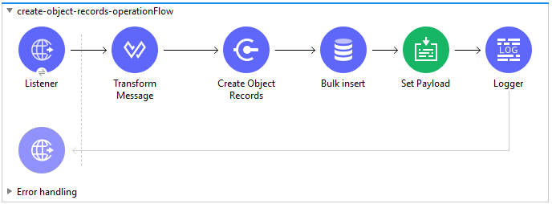

*Example XML Code:*

--------------------
	<flow name="create-object-records-operationFlow" doc:id="76d86207-916a-4be2-8928-fdd6c717c346" >
		<http:listener doc:name="Listener" doc:id="2b5b8ff3-491c-4573-96db-a3b0326f667b" config-ref="HTTP_Listener_config" path="/create-object-records"/>
		<ee:transform doc:name="Transform Message" doc:id="df08cf9f-3ab4-4f23-97e4-a2726ff78e03" >
			<ee:message >
				<ee:set-payload ><![CDATA[%dw 2.0
				output application/csv headerLineNumber = 0 , header = true , separator = ","
				---
				payload map ( payload01 , indexOfPayload01 ) -> {
					name__v: payload01.name__v ++ '|' ++ randomInt(10000) as String,
					location__v: payload01.location__v,
					external_id__v: (payload01.external_id__v default "") ++ "|" ++ randomInt(10000) as String,
					study_country__v: payload01.study_country__v,
					principal_investigator__v: payload01.principal_investigator__v,
					actual_siv__v: (payload01.actual_siv__v default "2018-07-19") as Date,
					site_selected_date__v: payload01.site_selected_date__v as Date
				}]]></ee:set-payload>
			</ee:message>
		</ee:transform>
		<veevavault:create-object-records doc:name="Create Object Records" doc:id="75b80a1e-0338-4f9e-b9e5-81c944381ddb" metadataFormat="CSV" objectName="site__v" target="objectstatus" config-ref="Veeva_Vault_Config"/>
		<logger level="INFO" doc:name="Logger" doc:id="a5fa54dd-1538-4d67-978a-565fba62fbb9" message="Create Object Response :: #[vars.objectstatus]"/>
		<db:bulk-insert doc:name="Bulk insert" doc:id="14110393-ec5e-4d69-b9e0-3b52b039da35" config-ref="Database_Config">
			<db:bulk-input-parameters ><![CDATA[#[output application/java
			---
			vars.objectstatus.data map () -> {
				'id': $.data.id,
				'url': $.data.url,
				'responseStatus': $.responseStatus
			}]]]></db:bulk-input-parameters>
			<db:sql >INSERT INTO deletesiteobject (id, url, responseStatus) VALUES (:id, :url, :responseStatus)</db:sql>
		</db:bulk-insert>
		<set-payload value="#[vars.objectstatus]" doc:name="Set Payload" doc:id="1d7bd1ba-9b04-4634-b3e6-380de0fe64f7" />
		<logger level="INFO" doc:name="Logger" doc:id="b4816f4f-f199-43ee-b00b-c9b389d4343a" message="Create Object Flow complete :: #[payload]"/>
		<error-handler >
			<on-error-propagate enableNotifications="true" logException="true" doc:name="On Error Propagate" doc:id="e681ed06-c458-42ef-bf24-217a42c85866" type="ANY" >
				<logger level="INFO" doc:name="Logger" doc:id="a47171c6-6b6e-47e5-97cd-8a7d0695410d" message="Flow Exception Handled --  #[payload]" />
			</on-error-propagate>
		</error-handler>
	</flow>
--------------------

==== Get Object Records Example

To create Mule flow, follow these instructions:

* Drag and drop HTTP Listener from Mule palette to project canvas.
* Configure HTTP Listener as per your environment.
* Drag and drop Get Object Records operation from Veeva Vault Connector palette.
* Configure Veeva Vault connection configuration with username, password, vault Url, vault version, vault client Id.
* Click refresh button to correspond to Object Name to retrieve object name list.
* Select Object Name from Object Name drop down list.
* Add Object fields in object fields list as per business requirement to incorporate fields name in VQL query build dynamically.
* Drag For-Each element after Get Documents operation.
* Drag Set Variable element to insert each object records into array variable
* Drag Database Bulk Insert operation to insert object records data into table
* Drag Set Payload element to set payload that can be returned to triggered source.
* Drag Logger element to log information in console or log file.

*Example XML Code:*

--------------------
	<flow name="get-object-records-operationFlow" doc:id="53818dc8-f0fd-4ccd-967f-e83dadcc1525">
		<http:listener doc:name="Listener" doc:id="190a5ad6-d379-4ff8-a8c4-b2b9cddbed2b" config-ref="HTTP_Listener_config" path="/get-object-records" />
		<veevavault:get-object-records doc:name="Get Object Records" doc:id="0ee4a657-c261-43c4-acce-00577bebb6c1" vaultObject="site__v" config-ref="Veeva_Vault_Config" whereClause="principal_investigator__v = '0PE000000000101'" fetchSize="1000">
			<veevavault:object-fields>
				<veevavault:object-field value="name__v" />
				<veevavault:object-field value="location__v" />
				<veevavault:object-field value="study_country__v" />
				<veevavault:object-field value="external_id__v" />
				<veevavault:object-field value="actual_siv__v" />
				<veevavault:object-field value="site_selected_date__v" />
				<veevavault:object-field value="principal_investigator__v" />
				<veevavault:object-field value="site_status__v" />
			</veevavault:object-fields>
		</veevavault:get-object-records>
		<foreach doc:name="For Each" doc:id="ab811c9e-2595-487e-a9ab-05aa5e4dc1d8">
			<set-variable value="#[output application/java --- vars.records default[] ++ [payload]]" doc:name="Set Variable" doc:id="060d7249-9251-4d5c-9b5d-1a63102cf6ae" variableName="records" />
		</foreach>
		<db:bulk-insert doc:name="Bulk insert" doc:id="3a3f03cd-afc2-48e8-9049-38b3058457f4" config-ref="Database_Config">
			<db:bulk-input-parameters><![CDATA[#[%dw 2.0
			output application/java
			---
			vars.records map  {
				'name__v': $.name__v,
				'location__v': $.location__v,
				'study_country__v': $.study_country__v,
				'external_id__v': $.external_id__v,
				'actual_siv__v': $.actual_siv__v,
				'site_selected_date__v': $.site_selected_date__v,
				'principal_investigator__v': $.principal_investigator__v
			}]]]></db:bulk-input-parameters>
						<db:sql>INSERT INTO siteobjectrecords (name__v, location__v, study_country__v, external_id__v, actual_siv__v,
			site_selected_date__v, principal_investigator__v) VALUES (:name__v, :location__v, :study_country__v, :external_id__v,
			 :actual_siv__v, :site_selected_date__v, :principal_investigator__v)</db:sql>
		</db:bulk-insert>
		<set-payload value="#[output application/json --- vars.records]" doc:name="Set Payload" doc:id="142fde66-1c98-4a4d-abd9-283bf3c031d7" />
		<logger level="INFO" doc:name="Logger" doc:id="b9e95b86-ac51-4846-aa06-e8fcbeee4a46" message="Vault Object retrieved :: #[payload]" />
		<error-handler>
			<on-error-propagate enableNotifications="true" logException="true" doc:name="On Error Propagate" doc:id="54095f77-47cc-4768-ad37-113a2d1481ec" type="ANY">
				<logger level="INFO" doc:name="Logger" doc:id="b14cc42b-9c2a-4e36-bbb3-30c834e8e3f0" message="Flow Exception Handled --  #[payload]" />
			</on-error-propagate>
		</error-handler>	
</flow>
--------------------

==== Update Object Records Example

To create Mule flow, follow these instructions:

* Drag and drop HTTP Listener from Mule palette to project canvas.
* Configure HTTP Listener as per your environment.
* Drag Transform Message component to transform object metadata in CSV format and configure with mapping.
* Drag Update Object Records operation from Veeva Vault Connector palette.
* Configure Veeva Vault connection configuration with username, password, vault url, vault version, vault client Id.
* Select Object Name from Object Name drop down list (Click refresh button to retrieve object name list).
* Select CSV from Metadata format drop down list.
* Drag Logger element to log information in console or log file.

*Example XML Code:*

--------------------
	<flow name="update-object-records-from-external" doc:id="a51bda88-f358-40ad-9986-8e6aea559e3c" >
		<http:listener doc:name="Listener" doc:id="cc2fb1da-1f14-4cef-91af-12ea9a7e1beb" config-ref="HTTP_Listener_config" path="/update-object-records"/>
		<ee:transform doc:name="Transform Message" doc:id="6f84dd71-083e-404d-ad7a-c896daa3f796" >
			<ee:message >
				<ee:set-payload ><![CDATA[%dw 2.0
				output application/json
				---
				payload map ( payload01 , indexOfPayload01 ) -> {
					id: payload01.id,
					name__v: payload01.name__v,
					location__v: payload01.location__v,
					external_id__v: payload01.external_id__v
				}]]></ee:set-payload>
			</ee:message>
		</ee:transform>
		<veevavault:update-object-records doc:name="Update Object Records (Site)" doc:id="5a16fb75-f150-44c9-bf33-3a25878cf197" metadataFormat="JSON" objectName="site__v" config-ref="Veeva_Vault_Config"/>
		<logger level="INFO" doc:name="Logger" doc:id="507ee77d-7f6c-429d-81ae-17359bb3afc1" message="Vault Object Updated :: #[payload]"/>
		<error-handler >
			<on-error-propagate enableNotifications="true" logException="true" doc:name="On Error Propagate" doc:id="68925d3d-4e42-4662-84ed-c9ba581e333b" type="ANY" >
				<logger level="INFO" doc:name="Logger" doc:id="d0ea5c85-c456-4ab9-89c7-7da2a51c929b" message="Flow Exception Handled --  #[payload]" />
			</on-error-propagate>
		</error-handler>
	</flow>
--------------------

==== Query Example

To create Mule flow, follow these instructions:

* Drag and drop HTTP Listener from Mule palette to project canvas.
* Configure HTTP Listener as per your environment.
* Drag Query operation from Veeva Vault Connector palette.
* Configure Veeva Vault connection configuration with username, password, vault Url, vault version, vault client Id.
* Define VQL query as per business requirement.
* Add input placeholder if used in VQL query to incorporate dynamically with VQL at runtime.
* Drag For-Each element after Query operation.
* Drop Transform Message and File - Write operation from respective palette.
* Configure transformation using Dataweave as per your business need for transforming payload.
* Configure File connector configuration with working file path and Write operation to write payload data into specified file.
* Drag Set Payload element after For-Each to set payload that can be returned to triggered source.
* Drag Logger element to log information in console or log file.

*Example XML Code:*

--------------------
	<flow name="query-operation-with-database-operationFlow" doc:id="451f0f78-1e2e-4cc4-b56d-4f427f01e30a" >
		<http:listener doc:name="Listener" doc:id="454e6602-2c2f-4e98-8569-b3e928bf3da5" config-ref="HTTP_Listener_config" path="/query"/>
		<veevavault:query doc:name="Query" doc:id="e4310f17-b0f5-49c0-8662-bc2d798fd9de" fetchSize="1000" config-ref="Veeva_Vault_Config">
			<veevavault:vql >SELECT id, name__v, type__v, subtype__v, classification__v, lifecycle__v, status__v, study__v, product__v  from :table WHERE name__v= 'F22611234--6764'</veevavault:vql>
			<veevavault:input-parameters ><![CDATA[#[{
				'table': 'documents'
			}]]]></veevavault:input-parameters>
		</veevavault:query>
		<foreach doc:name="For Each" doc:id="55a3f3e9-b0ad-4c6d-8ccf-96f2d11f7bc8" >
		<ee:transform doc:name="Transform Message" doc:id="f4875262-fe32-42e6-8e21-a21e592a729d" >
			<ee:message >
				<ee:set-payload ><![CDATA[%dw 2.0
				output application/json
				---
				payload]]></ee:set-payload>
			</ee:message>
		</ee:transform>
		<file:write doc:name="Write" doc:id="cb88f995-b31f-4dcf-b508-ea8340ae84fb" path="query.json" config-ref="File_Config" mode="APPEND">
			<file:content><![CDATA[#[output application/json
			---
			payload]]]></file:content>
						</file:write>
		
		</foreach>
		<set-payload value="#['Flow Completed']" doc:name="Set Payload" doc:id="66f96a83-dfc9-4855-a65c-c35327cfec2a" />
		<logger level="INFO" doc:name="Logger" doc:id="016dc7a0-7014-44d9-bcbd-d2f540c2fc2e" message="Query Operation flow Completed - #[payload]"/>
		<error-handler >
			<on-error-propagate enableNotifications="true" logException="true" doc:name="On Error Propagate" doc:id="6a7998b6-4384-41fb-bb5a-625f5410003a" type="ANY">
				<logger level="INFO" doc:name="Logger" doc:id="46ee422c-4430-4b63-b1c3-6c993ad732fa" message="Flow Exception Handled --  #[payload]"/>
			</on-error-propagate>
		</error-handler>		
	</flow>
--------------------

==== Get Audit Details Example

To create Mule flow, follow these instructions:

* Drag and drop HTTP Listener from Mule palette to project canvas.
* Configure HTTP Listener as per your environment.
* Drag Get Audit Details operation from Veeva Vault Connector palette.
* Configure Veeva Vault connection configuration with username, password, vault Url, vault version, vault client Id.
* Click refresh button to fetch audit types list from vault.
* Select Audit Type from drop down list.
* Drag For-Each element after Get Audit Details operation.
* Drop Transform Message and File - Write operation from respective palette.
* Configure transformation using Dataweave as per your business need for transforming payload.
* Configure File connector configuration with working file path and Write operation to write payload data into specified file.
* Drag Set Payload element after For-Each to set payload that can be returned to triggered source.
* Drag Logger element to log information in console or log file.

*Example XML Code:*

--------------------
	<flow name="get-audit-details-operationFlow" doc:id="33cb5d09-419b-435e-8744-e93a318a7ccb" >
		<http:listener doc:name="Listener" doc:id="3880815e-a45e-45dc-bd93-163adea84db6" config-ref="HTTP_Listener_config" path="/get-audit-details"/>
		<veevavault:get-audit-details doc:name="Get Audit Details" doc:id="e05e19d4-1422-43f4-a14e-f4c94660a838" config-ref="Veeva_Vault_Config" auditType="object_audit_trail"/>
		<foreach doc:name="For Each" doc:id="40573cba-b238-44f9-bf71-9a1fa7b23197" >
			<ee:transform doc:name="Transform Message" doc:id="6a17ec35-1ec0-4b83-9bbd-1dbc59feacb5" >
				<ee:message >
					<ee:set-payload ><![CDATA[%dw 2.0
					output application/json
					---
					payload]]></ee:set-payload>
				</ee:message>
			</ee:transform>
			<file:write doc:name="Write" doc:id="09e842a6-6cee-42ee-8fce-4aeb3eb4898e" path="get-audit-details.json" config-ref="File_Config" mode="APPEND">
				<file:content ><![CDATA[#[%dw 2.0 
				output application/json
				--- 
				payload]]]></file:content>
			</file:write>
		</foreach>
		<set-payload value="#[output application/json --- payload.payload map () -&gt; $]" doc:name="Set Payload" doc:id="a48d5e43-1377-4d3e-82ba-984b18c9cde5" />
		<logger level="INFO" doc:name="Logger" doc:id="51f56870-73ee-4b41-9d3e-078e64bd370a" message="Audit Details :: #[payload]"/>
		<error-handler >
			<on-error-propagate enableNotifications="true" logException="true" doc:name="On Error Propagate" doc:id="1933ca25-531a-4e43-baac-fc145ad79c93" type="ANY">
				<logger level="INFO" doc:name="Logger" doc:id="e02a58e6-2028-4c59-a649-e112443a3431" message="Flow Exception Captured #[payload]"/>
			</on-error-propagate>
		</error-handler>
	</flow>
--------------------

=== Connector Namespace and Schema

If you are creating Veeva Vault connector XML by hand, add the namespace for the connector. By contrast, Anypoint Studio creates the namespace for a connector automatically when you create a project for a Mule app.

--------------------
	xsi:schemaLocation="

	...

	http://www.mulesoft.org/schema/mule/veevavault
	http://www.mulesoft.org/schema/mule/veevavault/current/mule-veevavault.xsd"

	Example:

	<mule xmlns="http://www.mulesoft.org/schema/mule/core"
	xmlns:xsi="http://www.w3.org/2001/XMLSchema-instance"
	xmlns:veevavault="http://www.mulesoft.org/schema/mule/veevavault"
	xsi:schemaLocation="
	http://www.mulesoft.org/schema/mule/core
	http://www.mulesoft.org/schema/mule/core/current/mule.xsd
	http://www.mulesoft.org/schema/mule/veevavault
	http://www.mulesoft.org/schema/mule/veevavault/current/mule-veevavault.xsd">

	<!-- Insert your configuration elements and your flow here -->

	</mule>
--------------------

=== Maven Dependencies Information

When creating an app manually from the XML, you need to set up the pom.xml for your project:

--------------------
	<build>
		<plugins>
			<plugin>
				<groupId>org.mule.tools.maven</groupId>
				<artifactId>mule-maven-plugin</artifactId>
				<version>${mule.maven.plugin.version}</version>
				<extensions>true</extensions>
				<configuration>
					<sharedLibraries> 
						<sharedLibrary>
							<groupId>org.json</groupId>
							<artifactId>json</artifactId>
						</sharedLibrary>
					</sharedLibraries>
				</configuration>
			</plugin>
		</plugins>
	</build>
	<repositories>
		<repository>
			<id>anypoint-exchange-v2</id>
			<name>Anypoint Exchange</name>
			<url>https://maven.anypoint.mulesoft.com/api/v2/maven</url>
			<layout>default</layout>
		</repository>
		<repository>
			<id>mulesoft-releases</id>
			<name>MuleSoft Releases Repository</name>
			<url>https://repository.mulesoft.org/releases/</url>
			<layout>default</layout>
		</repository>
	</repositories>

This snippet specifies a project dependency for a specific release version:

	<dependency>
		<groupId>org.mule.extension</groupId>
		<artifactId>mule-veevavault-connector</artifactId>
		<version>RELEASE</version>
		<classifier>mule-plugin</classifier>
	</dependency>
--------------------
